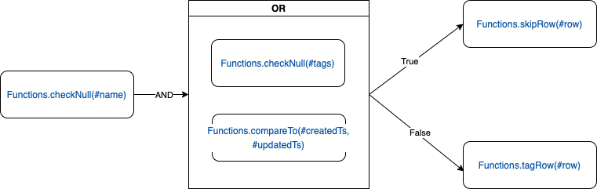

# 基于SpEl的规则构建

## 示例


## 数据结构
```json5
{
  "type": "TERN",
  "on": {
    "type": "AND",
    "group": false,
    "list": [
      {
        "type": "METH",
        "ref": "Functions",
        "name": "checkNull",
        "parameters": [
          {
            "name": "name",
            "index": 0
          }
        ]
      },
      {
        "type": "OR",
        "group": true,
        "list": [
          {
            "type": "METH",
            "ref": "Functions",
            "name": "checkNull",
            "parameters": [
              {
                "name": "tags",
                "index": 0
              }
            ]
          },
          {
            "type": "METH",
            "ref": "Functions",
            "name": "compareTo",
            "parameters": [
              {
                "name": "createdTs",
                "index": 0
              },
              {
                "name": "updatedTs",
                "index": 1
              }
            ]
          }
        ]
      }
    ]
  },
  "left": {
    "type": "METH",
    "ref": "Functions",
    "name": "skipRow",
    "parameters": [
      {
        "name": "row",
        "index": 0
      }
    ]
  },
  "right": {
    "type": "METH",
    "ref": "Functions",
    "name": "tagRow",
    "parameters": [
      {
        "name": "row",
        "index": 0
      }
    ]
  }
}
```

### 输出
```text
#Functions.checkNull(#name) && (#Functions.checkNull(#tags) || #Functions.compareTo(#createdTs, #updatedTs))?#Functions.skipRow(#row):#Functions.tagRow(#row)
```